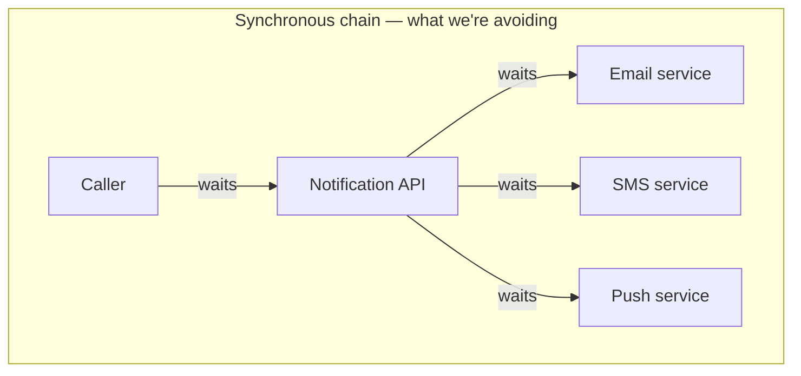
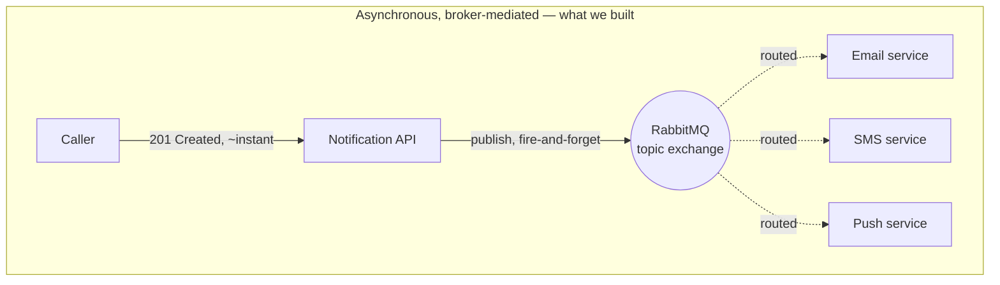
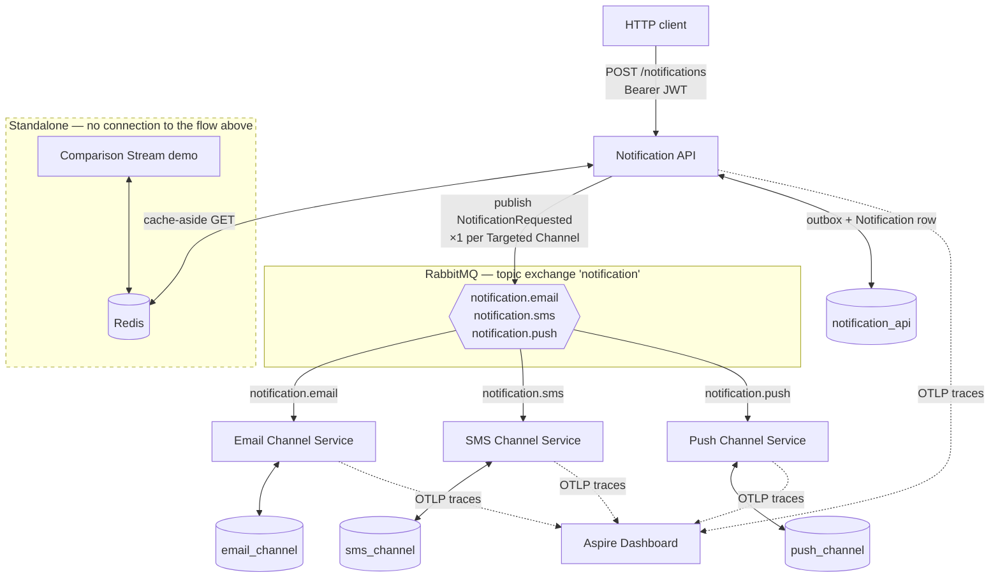
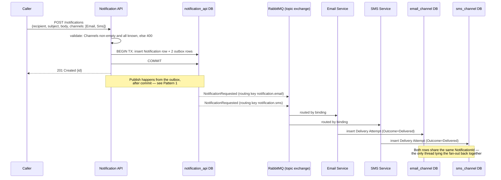
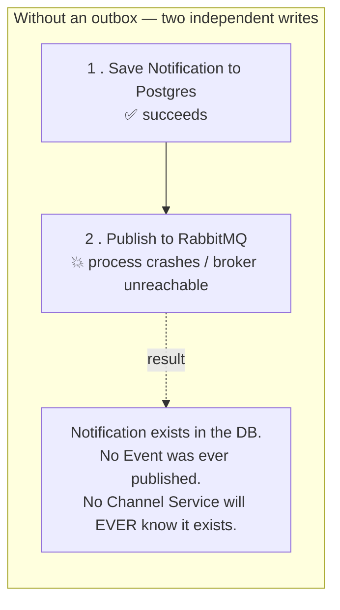
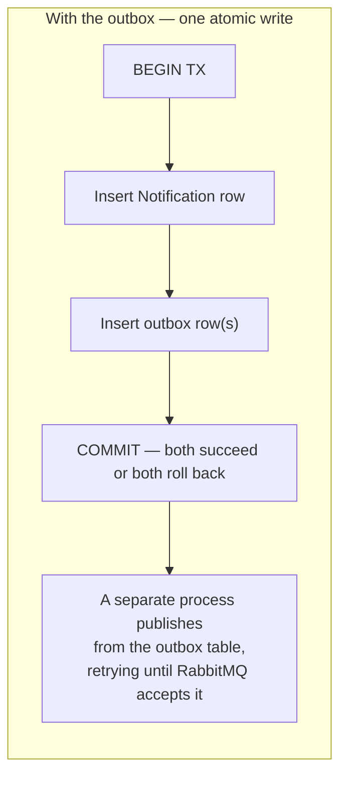
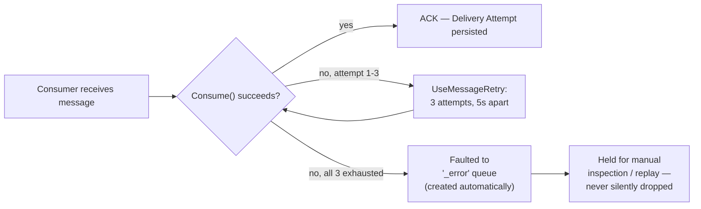
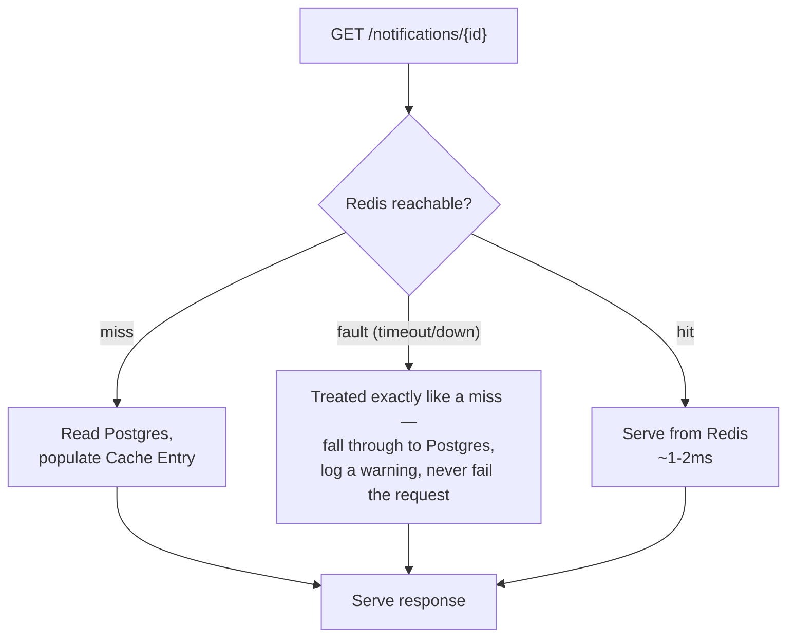
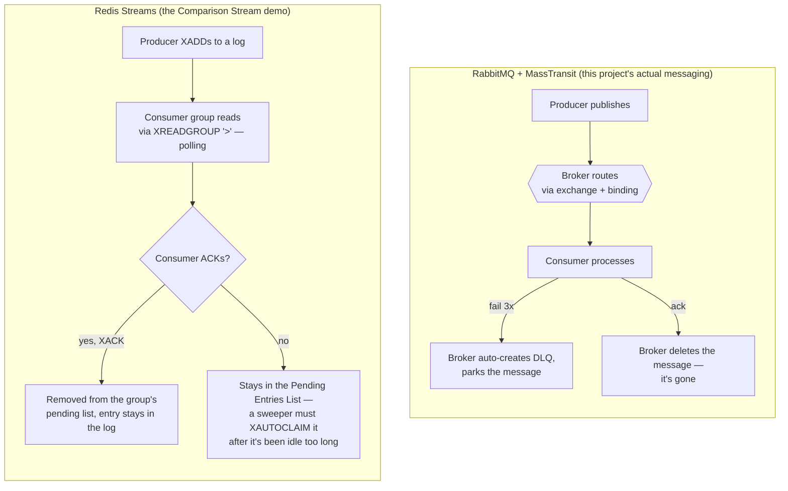

# Notification Platform: Architecture & Messaging Patterns

This document explains the Notification Platform end to end: what it is, how its pieces fit together, and — for every production-grade pattern it implements — what problem the pattern solves and why skipping it would be a real bug in a real system, not just a style preference. It assumes no prior message-broker experience. By the end you should understand not only this codebase, but how async message buses work in general and when you'd reach for one.

The system itself: a caller asks the platform to notify someone. The platform accepts that request, and three independent services — Email, SMS, Push — each try to deliver it over their own channel, entirely decoupled from the caller and from each other. That single sentence is the whole point of the exercise, and almost every design decision below exists to make it true under real-world failure conditions: crashes mid-request, a broker outage, a duplicate delivery, a slow downstream dependency.

## Table of contents

1. [Why build a message bus at all](#1-why-build-a-message-bus-at-all)
2. [This project's architecture](#2-this-projects-architecture)
3. [The core flow: accepting and fanning out a notification](#3-the-core-flow-accepting-and-fanning-out-a-notification)
4. [Production-grade patterns, one at a time](#4-production-grade-patterns-one-at-a-time)
5. [Two messaging models, compared](#5-two-messaging-models-compared)
6. [Security notes and deliberate scope cuts](#6-security-notes-and-deliberate-scope-cuts)
7. [How this was verified, not just claimed](#7-how-this-was-verified-not-just-claimed)
8. [Try it yourself](#8-try-it-yourself)
9. [Glossary](#9-glossary)

---

## 1. Why build a message bus at all

Imagine the naive version of this system: the Notification API receives a request and, before responding, calls the Email service, then the SMS service, then the Push service — synchronously, over HTTP, one after another.



This has three fatal problems, and every one of them shows up eventually in production:

- **The caller waits for the slowest downstream service.** If Push is having a bad day, every notification request — including the ones that only wanted Email — gets slow or times out.
- **A downstream outage becomes an upstream outage.** If the SMS service is down for maintenance, the Notification API either fails the whole request or needs custom fallback logic for every single downstream call. Do this three times and the code is unmaintainable.
- **The services are no longer independent.** Deploying, scaling, or restarting the Email service now has to be coordinated with the fact that the Notification API is calling it directly. The entire point of splitting this into separate services — independent development and deployment — is undone by wiring them together synchronously.

A **message broker** breaks this chain. The Notification API publishes one fact — "this notification was requested" — to the broker and returns immediately. The broker holds that fact durably until each interested consumer has picked it up. The producer and the consumers never call each other directly, never share a deploy cycle, and never block on each other.



The vocabulary that comes with this pattern, used throughout this document:

| Term | Meaning here |
|---|---|
| **Producer** | A service that publishes facts to the broker (the Notification API). |
| **Broker** | The intermediary that receives, routes, and durably holds messages (RabbitMQ). |
| **Exchange / topic** | The broker-side routing rule that decides which queue(s) a published message lands in. |
| **Queue** | Where a broker parks messages for one consumer (or a competing group of consumers) to read. |
| **Consumer** | A service that reads from a queue and acts on what it finds (the three Channel Services). |
| **Message** | The transport-level envelope the broker actually moves — headers, serialization, routing metadata. |

**When you'd reach for this pattern in general**: whenever a producer needs to hand work to one or more independent consumers without waiting for them, without knowing how many there are, and without the consumers' availability affecting the producer's. Order processing, webhook fan-out, background jobs, event-driven integrations between services owned by different teams — all the same shape as this notification system.

---

## 2. This project's architecture



Every logical Postgres database lives in one shared `postgres:17-alpine` container (a deliberate resource-saving compromise for local development, not a statement about isolation — see [ADR-0002](../docs/adr/0002-database-per-service-shared-postgres-container.md)). Every service is a .NET 10 project; `Contracts` and `BuildingBlocks` are shared libraries with no service-specific code, so the shared plumbing (routing vocabulary, health checks, OpenTelemetry, caching, database migration) is written once.

| Component | Image / framework | Role |
|---|---|---|
| Notification API | .NET 10 Minimal API | Single entry point; accepts requests, publishes events, serves cached reads |
| Email / SMS / Push Channel Service | .NET 10 worker + Minimal API (health only) | One per Channel; consumes, simulates delivery, persists the result |
| RabbitMQ | `rabbitmq:4-management-alpine` | The broker — durable queues, routing, retry, dead-lettering |
| Postgres | `postgres:17-alpine` | Source of truth — one logical database per service |
| Redis | `redis:7-alpine` | Cache-aside store for the API's reads, and host to the standalone Comparison Stream demo |
| Aspire Dashboard | `mcr.microsoft.com/dotnet/aspire-dashboard:13` | OpenTelemetry trace/metric/log sink and viewer |

### Domain language

The project's `CONTEXT.md` fixes this vocabulary precisely because these words are easy to conflate — a **Notification** is a business request, an **Event** is what travels the wire, and a **Message** is the broker envelope around it. Mixing them up is a very common source of confused bug reports in real systems ("the notification failed" — which layer, exactly?).

| Term | Meaning |
|---|---|
| **Notification** | The business-level request ("tell this person X"), independent of delivery mechanism. Only ever *accepted*, never "sent" or "failed" itself. |
| **Channel** | One delivery medium — Email, SMS, or Push. Exactly one Channel Service implements each. |
| **Targeted Channel** | A Channel the caller actually named on a given Notification. |
| **Event** | A fact published to the broker, e.g. `NotificationRequested`. Scoped to *one* Targeted Channel — a Notification targeting two Channels produces two Events. |
| **Message** | The MassTransit/RabbitMQ transport envelope carrying an Event — used only when discussing broker mechanics (retries, DLQ). |
| **Delivery Attempt** | A Channel Service's own persisted record of trying to deliver — this *is* "notification status" in this system; there's no separate status concept. |
| **Idempotency Key** | Derived from the Event's message ID; lets a Channel Service recognize "I've already done this" and skip a redelivered Message. |
| **Outbox** | The Notification API's staging table, written in the same DB transaction as the Notification itself, so a publish is never silently lost. |
| **Dead Letter** | A Message a Channel Service gave up on after exhausting retries, parked for manual inspection rather than retried forever. |
| **Cache Entry** | Data a service reads from Redis instead of Postgres, scoped and owned by the service that wrote it. |
| **Comparison Stream** | The standalone Redis Streams demo — not part of the Notification flow, built purely to contrast broker semantics. |

---

## 3. The core flow: accepting and fanning out a notification



Two design choices are worth explaining, because they were genuine decisions (recorded in [ADR-0003](../docs/adr/0003-caller-selected-channels-via-topic-exchange.md)) rather than defaults:

**The broker routes; consumers never filter.** Every `NotificationRequested` is published to a single topic exchange named `notification`, with a routing key of `notification.<channel>` (`notification.email`, `notification.sms`, `notification.push`). Each Channel Service binds its queue to only its own key. The alternative — publish one broadcast Event to all three services and let each drop what isn't theirs — was explicitly rejected: it wakes up two-thirds of the fleet for nothing, and it makes "caller selected Email and SMS only" a lie the broker doesn't actually enforce. Making the broker do the routing is also *the whole point* of using a topic exchange instead of a trivial single queue — this project exists to teach that mechanism, not to hide it.

**One Notification becomes several Events.** A Notification targeting Email and SMS produces two independent `NotificationRequested` Events, each with its own message ID and therefore its own Idempotency Key. The `NotificationId` field is the only thread tying them back together — it travels on every Event and lands on every resulting Delivery Attempt, which is how you'd later reconstruct "what happened to Notification X across all its channels" despite each Channel Service keeping its Delivery Attempts in a database none of the others can see.

**A request that can produce no Delivery Attempt is rejected outright.** An empty or unrecognized Channel list never reaches the outbox — it's a 400 at the API boundary. Accepting it would create a Notification that structurally can never have an outcome, which violates the domain model's own rule that "notification status" *is* its Delivery Attempts.

---

## 4. Production-grade patterns, one at a time

Each of these exists because of a specific failure mode. The pattern is not decoration — remove it, and that failure mode reappears.

### Pattern 1 — The transactional outbox

**The problem it solves — the dual-write problem.** The Notification API needs to do two things when it accepts a request: save the Notification to Postgres, and publish an Event to RabbitMQ. These are two separate systems with no shared transaction. If you do them naively, one after the other, there is no way to make both succeed or both fail together:



Reverse the order and you get the opposite failure: the Event publishes, a Channel Service delivers it, and then the API's own transaction rolls back — now a Delivery Attempt exists for a Notification the system itself denies accepting.

**What this project does about it.** The Notification API writes the Notification row *and* an outbox row, in the same Postgres transaction (`AddEntityFrameworkOutbox<NotificationDbContext>` with `UseBusOutbox()`). MassTransit's outbox delivery mechanism then reads that table and publishes to RabbitMQ afterward, retrying the publish itself if the broker is briefly unreachable.



**Why this is mandatory in production, not optional polish.** Without it, you have a system that *looks* correct in every demo and every happy-path test, and then silently drops data the first time it experiences the exact conditions production guarantees will eventually happen: a crash between two operations, or a momentary broker blip during a deploy. This is one of the most common real-world causes of "the customer says they never got the email, but our logs say it was created" tickets — and it's invisible until it happens, because nothing throws an exception when it does.

### Pattern 2 — Idempotent consumers (the inbox pattern)

**The problem it solves.** A message broker's core delivery guarantee is *at-least-once*, not *exactly-once*. If a Channel Service processes a message, writes its Delivery Attempt, but the acknowledgment back to RabbitMQ is lost (a network blip, a restart at the wrong instant), RabbitMQ will redeliver that exact same message. Without protection, that means a second Delivery Attempt — in this domain, a second email sent to a real person for the same event.

**What this project does about it.** Every Channel Service registers MassTransit's EF Core **consumer inbox**, keyed on the message's own ID. When a redelivered message arrives, MassTransit checks the inbox table before ever invoking the consumer's `Consume` method — a duplicate never even reaches the business logic a second time.

This was proven live during this project's end-to-end verification, not just asserted: the exact same message (identical MassTransit MessageId) was replayed at the RabbitMQ level while a Channel Service was stopped, then the service was started with two copies of the message waiting in its queue. The consumer's "processed" log line appeared exactly once, and exactly one Delivery Attempt row landed in the database — the second delivery was silently absorbed by the inbox.

**Why this is mandatory.** "At-least-once" is not a corner case you can choose to ignore — it is the fundamental guarantee every mainstream broker (RabbitMQ, Kafka, SQS) actually offers, because *exactly-once* delivery across a network is provably impossible to guarantee without cooperation from the receiver. A production consumer that assumes each message arrives once will eventually double-charge a customer, double-send a notification, or double-count an event. Idempotency has to live on the consumer side because that's the only side that can actually enforce it.

### Pattern 3 — Bounded retry and dead-lettering

**The problem it solves.** A consumer failure can be transient (a downstream provider timed out once) or permanent (the message itself is malformed and will never process). Treat every failure as transient and retry forever, and one bad message blocks every message queued behind it — the queue effectively stops. Treat every failure as permanent and give up immediately, and you throw away work that would have succeeded on the very next attempt.



**What this project does about it.** Each Channel Service configures `UseMessageRetry(r => r.Interval(3, TimeSpan.FromSeconds(5)))` — three attempts, five seconds apart, entirely in-memory, no broker round-trip per retry. When all three are exhausted, MassTransit faults the message to a `<queue>_error` queue that RabbitMQ creates automatically, with zero manual topology required. This was verified by deliberately injecting a forced failure: the message retried three times over roughly 20 seconds, then landed in `sms-notification-requested_error` with zero Delivery Attempt rows written for it — proving both halves work, the retry *and* the eventual give-up.

**Why this is mandatory.** Every production message queue eventually receives a message it cannot process — a downstream provider that's actually down, a genuinely malformed payload, a bug that only one specific input triggers. Without bounded retry, transient blips become customer-visible failures for no reason. Without a dead-letter queue, permanent failures either loop forever (starving every message behind them, a classic "poison message" outage) or get silently discarded (data loss with no audit trail). The DLQ is what turns "we have no idea what happened to that message" into "here's exactly which messages failed and why, ready to inspect or replay."

### Pattern 4 — Health checks: liveness vs. readiness

**The problem it solves.** "Is this service healthy?" is actually two different questions that get conflated constantly:

- *Is the process itself still functioning* (not deadlocked, not out of memory)? If not, restarting it is the right fix.
- *Can this instance actually do its job right now* (are its dependencies reachable)? If not, routing traffic away from it is the right fix — but restarting it fixes nothing, because the problem isn't the process, it's a downstream dependency the process doesn't control.

Conflating these means either restarting a perfectly healthy process every time a downstream database has a blip (making a transient problem worse by adding cold-start churn on top of it), or never detecting a genuinely broken instance because "the process is running" was treated as good enough.

**What this project does about it.** Two separate endpoints: `/health/live` answers only "is the process working," and stays green through a dependency outage. `/health/ready` aggregates every real dependency — Postgres (`AddDbContextCheck`), RabbitMQ (MassTransit's own automatic `masstransit-bus` check), and, on the Notification API, Redis (a small custom round-trip check added once that service actually held a Redis connection). Docker Compose's `depends_on: condition: service_healthy` gates startup ordering on readiness, and each service's own container healthcheck watches it too.

**The gotcha that makes this pattern worth telling as a story, not just a checklist item.** MassTransit's bus health check reports a disconnected broker as `Degraded`, by design — it's still retrying the connection, not dead. But ASP.NET Core's *default* health check middleware maps `Degraded` to HTTP 200, the same status code as fully healthy. That means, out of the box, stopping RabbitMQ for 90 seconds did not move `/health/ready`'s status code at all — confirmed by actually doing it. The fix was one explicit line remapping `Degraded` to 503. This is a genuinely easy mistake to make and a genuinely dangerous one to miss: a readiness probe that silently never fires is worse than no readiness probe at all, because it looks like protection while providing none.

**Why this is mandatory.** In any environment with more than one instance of a service — which is to say, any real production environment — an orchestrator or load balancer uses readiness to decide where to route traffic and liveness to decide when to restart. Get the split wrong, and you either send live traffic to instances that can't serve it, or you restart instances that would have recovered on their own the moment their dependency came back.

### Pattern 5 — Distributed tracing (OpenTelemetry)

**The problem it solves.** One user-facing action — "send this notification" — now touches four independently deployed processes: the API, and three Channel Services, each with their own logs, on their own timeline, in their own container. When something is slow or fails, "grep four sets of logs and manually match up timestamps" does not scale past a handful of services, and it gets actively misleading once retries and concurrent requests are in the mix.

**What this project does about it.** Every service wires the same OpenTelemetry setup (`AddPlatformObservability`), exporting traces, metrics, and logs to a shared Aspire Dashboard over OTLP. Critically, MassTransit publishes its own trace spans under the `MassTransit` activity source, and it propagates the W3C trace context (`MT-Activity-Id`) as a RabbitMQ message header — so a publish on the Notification API and the corresponding consume on a Channel Service are stitched into *one* trace automatically, with zero manual correlation-ID plumbing. This was confirmed live: a single fan-out to all three channels rendered as one correlated trace in the dashboard, publish and all three consumes together.

**Why this is mandatory.** Distributed systems fail in distributed ways — a slowdown that's actually three hops upstream, a failure that only manifests as a symptom two services away from its cause. Without correlated tracing, every incident investigation starts from zero context and rebuilds the causal chain by hand. With it, "what happened to Notification X" is one query, not an afternoon.

### Pattern 6 — Resilient cache-aside reads (Redis + Polly)

**The problem it solves.** Caching a hot read path (`GET /notifications/{id}`) is an easy win — but only if a cache outage degrades to "slightly slower" rather than "completely broken." A cache is, by definition, an accelerator in front of data that's already durably stored elsewhere (Postgres). If a naive, unwrapped Redis call can throw an unhandled exception straight into a request, you've turned an optional accelerator into a new single point of failure for a resource that was perfectly available without it.



**What this project does about it.** A shared `GetOrCreateAsync` helper wraps every Redis call in a Polly pipeline (one fast retry, then a tight timeout) and treats any surviving fault exactly like a cache miss: fall through to Postgres, log a warning naming the degraded operation, never fail the caller. Writes call the matching `InvalidateAsync`, whose own failure is logged and swallowed rather than failing an already-committed write.

**The gotcha that makes this worth understanding, not just copying.** The Polly pipeline alone did *nothing* the first time it was tested against a genuinely unreachable Redis — a stopped container still took 12–23 seconds per call. The reason: Polly v8's timeout strategy is *cooperative-cancellation-only*. It can only make an operation give up early if that operation actually checks its cancellation token — it cannot forcibly abort a call that's blocked waiting on a socket. The real fix had to happen one layer down, in StackExchange.Redis's own client configuration: tight `ConnectTimeout`/`SyncTimeout`/`AsyncTimeout` values (300ms) **and** `BacklogPolicy.FailFast` — without the latter, the client queues commands waiting for a connection instead of failing immediately, which alone still cost 2–4 seconds per call. Only with both together did a Redis outage drop to well under 100ms per request. This was measured, not assumed: real fault injection (stopping the container, timing real HTTP calls) caught what code review of the Polly config alone would have missed.

**Why this is mandatory.** A cache that can take your API down is worse than no cache — it converts a component with a very good uptime record (Postgres, already required to be up) into a dependency on a second component (Redis) that, if misconfigured, can turn "slightly slower" into "completely broken." Resilience config that isn't verified against a real, injected fault is a false sense of security — this pattern's whole lesson is that the layer doing the actual bounding matters more than which library you wrapped around it.

### Pattern 7 — Database-per-service, on one shared container

**The problem it solves.** When multiple services share a database schema, their release cycles become coupled — a migration for one service risks breaking a query written by another, and nobody can change their own tables without checking every other service first. This is one of the most common ways a "microservices" system ends up with all the deployment coordination cost of a monolith and none of the benefit.

**What this project does about it.** Each service owns its data exclusively: no service ever queries another's tables, and each provisions its own logical database via EF Core `Migrate()` at startup — there is no shared init SQL script. Physically, all four logical databases run in one `postgres:17-alpine` container ([ADR-0002](../docs/adr/0002-database-per-service-shared-postgres-container.md)) purely to save local resources; nothing in the code assumes co-location, so splitting into separate containers later is a docker-compose change, never a code change. The honest tradeoff, stated plainly in the ADR: because every service needs `CREATEDB` to self-provision, they all connect as one shared Postgres superuser, so the isolation boundary here is enforced by convention and code review, not by database-level grants. Tightening that would mean introducing per-service roles — a real architectural change, not something to bolt on quietly.

**Why this matters in production.** Data ownership is what actually makes services independent. An API contract between services can be reasoned about and versioned; a shared table that four services all write to cannot be, because a "breaking change" is now invisible until it breaks someone else's code at runtime.

---

## 5. Two messaging models, compared

This project deliberately builds a second, entirely separate demo — the **Comparison Stream** — that solves a superficially similar problem (fan out work to multiple consumers) using Redis Streams instead of RabbitMQ, specifically to make the differences concrete rather than theoretical.



| | RabbitMQ + MassTransit | Redis Streams |
|---|---|---|
| Delivery model | Broker pushes to consumers | Consumers pull (poll) from a log |
| Routing | Broker-side, via exchange + binding (this project's topic exchange) | None — every consumer group sees every entry; filtering is the consumer's job |
| Retry on failure | Automatic (`UseMessageRetry`), configured declaratively | **Not automatic.** An un-acked entry just sits in the group's Pending Entries List; you must write and run your own reclaim logic |
| Dead-lettering | Automatic `<queue>_error` queue, zero topology required | **Doesn't exist.** You'd have to build your own "moved after N reclaim attempts" logic on top of `XAUTOCLAIM` |
| Message lifecycle | Deleted once fully acknowledged by all bound queues | **Never deleted automatically** — the log persists and can be replayed from any point, including from before a new consumer group existed |
| Operational footprint | A dedicated broker process to run and monitor | Reuses infrastructure you may already run for caching |

The Comparison Stream demo makes the "not automatic" row tangible rather than abstract: one of its two consumers deliberately drops every fourth message, and a hand-written sweeper polls every ten seconds to reclaim anything left idle in the Pending Entries List for more than five seconds via `XAUTOCLAIM` — manually reimplementing, in about thirty lines, roughly what MassTransit's retry and DLQ give you for free through configuration.

**When you'd choose each, in practice:**

- **Reach for a broker like RabbitMQ (or Kafka, or a managed equivalent)** when you need the broker to own routing decisions, when retry/DLQ semantics matter and you don't want to hand-roll them, when consumers genuinely shouldn't need to know about each other's existence, or when you're willing to run and operate a dedicated piece of infrastructure for the reliability guarantees it buys you. This project's actual Notification flow is exactly this shape: independently deployed Channel Services, broker-enforced routing, and retry/DLQ that would be tedious and error-prone to reimplement by hand three separate times.
- **Reach for Redis Streams (or a similar log primitive)** when you want a lightweight, replayable, ordered log and you're already running Redis for something else — caching, in this project's case — so there's no new infrastructure to operate. It's a good fit when you're comfortable owning retry/reclaim logic yourself, when replay-from-any-point is actually valuable (an audit trail, a consumer that can be rebuilt from scratch by reading history), or when the operational simplicity of "it's just Redis" outweighs the broker features you'd be giving up.

Neither is strictly "better" — they trade broker-provided guarantees for operational simplicity in opposite directions, and this project builds both specifically so that tradeoff is something you can watch happen rather than take on faith.

---

## 6. Security notes and deliberate scope cuts

**Authentication is intentionally minimal, and must never be copied into anything real.** The Notification API issues its own JWTs from a hardcoded demo credential (`demo` / `demo-password`) via an unauthenticated `/token` endpoint — no real identity provider, no user store, no password hashing. This is explicitly scoped as a learning-environment shortcut so the project can demonstrate `[Authorize]`-gated endpoints without the overhead of standing up Duende IdentityServer or OpenIddict. In any real deployment, this entire flow would be replaced by a genuine identity provider.

**What was deliberately left out of scope, and why that's a scope decision, not a shortcut to imitate elsewhere:**

| Excluded | Why it's out of scope *here* |
|---|---|
| Kubernetes / cloud deployment | docker-compose is this project's explicit ceiling — the patterns transfer, the orchestrator doesn't need to |
| **An automated test suite** | Manual, hands-on verification was the deliberate choice for a *learning* exercise — this is the one cut worth flagging clearly as **not** something to imitate in real production. Skipping automated tests is a real cost taken on knowingly here in exchange for spending the time budget on the messaging patterns themselves. |
| Real delivery providers (SendGrid, Twilio, push services) | Delivery is simulated (logged + persisted) so the project's focus stays on messaging, not third-party API integration |
| A real external identity provider | Self-issued dev JWTs only, as above |
| An API gateway / reverse proxy | Services are exposed directly on compose ports; a gateway is a separate, orthogonal concern |
| Preference-driven channel selection (a recipient's standing choice of Channels) | Explicitly considered and rejected — it adds a service and a data model that serve the notification *product*, not the messaging *patterns* this project exists to teach |

---

## 7. How this was verified, not just claimed

Every pattern described above was proven against the actual running stack, not inferred from reading the code — including deliberately breaking things to watch the failure paths work:

- **Fan-out**: a Notification targeting all three Channels produced one Delivery Attempt per channel, all three sharing the same Notification identity.
- **Broker-side routing**: a Notification targeting only Email + SMS left Push completely idle — no consume, no Delivery Attempt — proving the topic exchange actually discriminates rather than every consumer filtering.
- **Input validation**: an empty or invalid Channel list is rejected with 400 and never reaches the outbox.
- **Retry + DLQ**: a forced consumer failure exhausted its three retries and landed in the `_error` queue, with zero Delivery Attempt rows written.
- **Idempotency**: the identical broker message (same MessageId) was replayed while a consumer was offline; on restart, the consumer inbox silently absorbed the duplicate, leaving exactly one Delivery Attempt.
- **Cache-aside**: a cold read hit Postgres and populated Redis; the second read served from Redis in roughly a tenth of the time.
- **Resilient degradation**: with Redis stopped, both reads and writes completed in well under 100ms (versus 12–23 seconds before the client's own fail-fast settings were tuned) with correct responses and a warning log naming the degraded operation.
- **Readiness gating**: stopping RabbitMQ held `/health/ready` at 503 for the full outage; the equivalent Redis check does the same once wired in.
- **Tracing**: a single fan-out rendered as one correlated trace across the publish and all three consumes in the Aspire Dashboard.
- **The Comparison Stream demo**: confirmed running fully independently of the Notification flow, including its own drop/reclaim cycle via live logs.

---

## 8. Try it yourself

```bash
# Bring up the whole stack
docker compose up -d

# Get a dev JWT (demo / demo-password — see Section 6)
TOKEN=$(curl -s -X POST http://localhost:5080/token \
  -H "Content-Type: application/json" \
  -d '{"username":"demo","password":"demo-password"}' \
  | python3 -c "import sys,json; print(json.load(sys.stdin)['accessToken'])")

# Fan out a notification to all three channels
curl -s -X POST http://localhost:5080/notifications \
  -H "Authorization: Bearer $TOKEN" -H "Content-Type: application/json" \
  -d '{"recipient":"you@example.com","subject":"Hello","body":"First notification","channels":["Email","Sms","Push"]}'

# Read it back — first call is a Postgres miss, second is a Redis hit
curl -s -H "Authorization: Bearer $TOKEN" http://localhost:5080/notifications/<id-from-above>

# Watch it all correlate in the dashboard
open http://localhost:18888   # or just navigate there
```

Ports: Notification API `5080`, RabbitMQ management UI `15672`, Aspire Dashboard `18888`, Postgres `5432`, Redis `6379`. Neither Channel Service publishes a host port — they're internal-only, reachable from other containers on the `notification-platform` network.

---

## 9. Glossary

See [`CONTEXT.md`](../CONTEXT.md) for the authoritative, actively-maintained domain glossary this document's Section 2 summarizes, and [`docs/adr/`](../docs/adr/) for the full reasoning behind each architecture decision referenced above.
